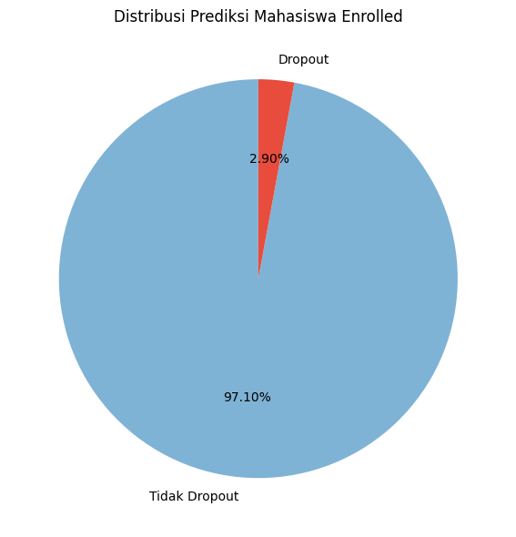
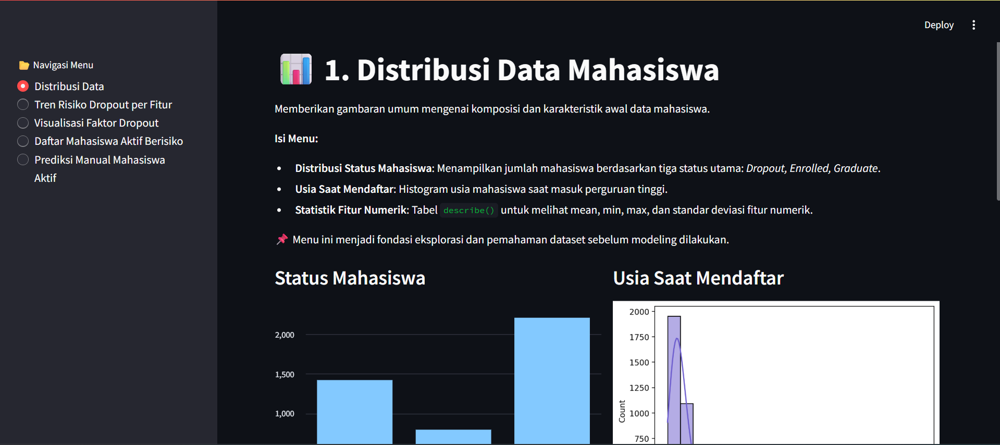
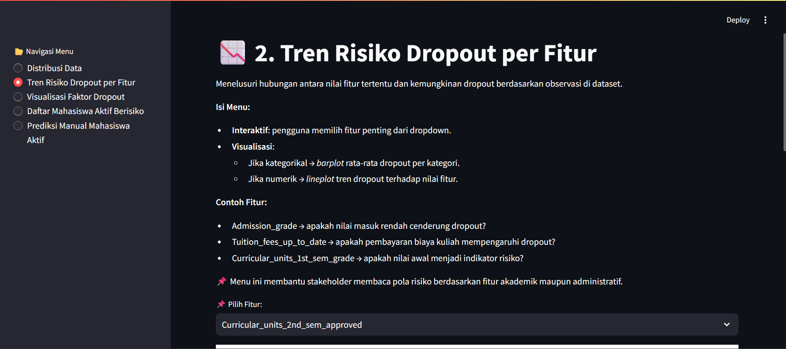
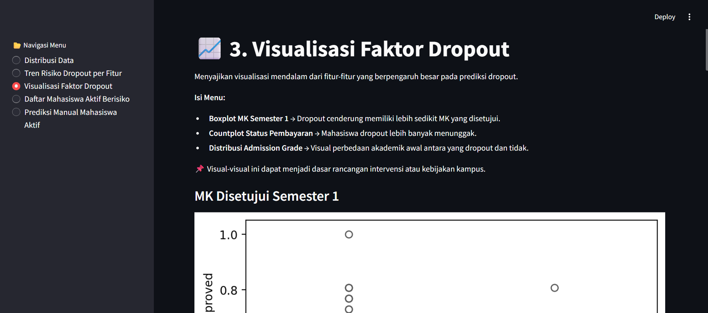
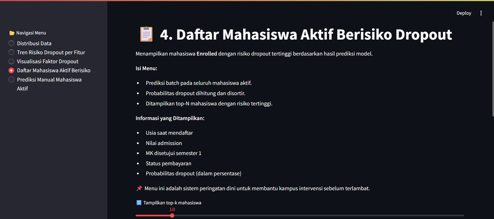
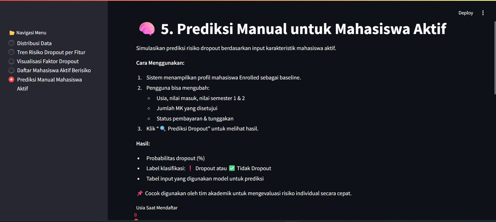

# 🎓 Proyek Akhir: Menyelesaikan Permasalahan Perusahaan Edutech  
**Jaya Jaya Institute – Analisis & Visualisasi Prediktif**

---

## 🧩 Latar Belakang Permasalahan

Jaya Jaya Institute merupakan institusi pendidikan tinggi yang telah menghasilkan banyak lulusan unggul. Namun, tingginya tingkat dropout mahasiswa menjadi tantangan serius yang berdampak pada akreditasi, reputasi, serta kepercayaan masyarakat. Oleh karena itu, diperlukan pendekatan berbasis data untuk mendeteksi mahasiswa berisiko sedini mungkin.

---

## 🎯 Tujuan Proyek

1. Menganalisis faktor-faktor utama penyebab mahasiswa mengalami dropout  
2. Membangun model prediktif menggunakan algoritma Machine Learning (Random Forest)  
3. Mendesain aplikasi dashboard interaktif berbasis Streamlit untuk menjembatani analisis, interpretasi, dan prediksi risiko dropout  
4. Memberikan sistem peringatan dini terhadap mahasiswa aktif dengan risiko tinggi

---

## 📌 Ruang Lingkup Proyek

- Pembersihan dan pra-pemrosesan data
- Analisis data eksploratif (EDA)
- Pelatihan model klasifikasi biner
- Evaluasi performa model dan interpretasi feature importance
- Deployment sistem prediksi dan dashboard visual interaktif

---

## Persiapan

**🗂️ Sumber Data:**
[Students' Performance](https://github.com/dicodingacademy/dicoding_dataset/blob/main/students_performance/README.md)

**Struktur Dataset**
Dataset memiliki beberapa variabel yang dapat dikategorikan sebagai berikut:

**1. Informasi Demografi**
- `Marital_status` : Status pernikahan mahasiswa *(1 - single, 2 - married, dst.)*
- `Nationality` : Kewarganegaraan mahasiswa *(1 - Portuguese, 2 - German, dst.)*
- `Gender` : Jenis kelamin mahasiswa *(1 - male, 0 - female)*
- `Age_at_enrollment` : Usia mahasiswa saat mendaftar *(Numerik)*
- `Displaced` : Apakah mahasiswa merupakan orang yang terdampak *(1 - yes, 0 - no)*

**2. Informasi Akademik**
- `Application_mode` : Metode pendaftaran yang digunakan *(1 - 1st phase - general contingent, dst.)*
- `Application_order` : Urutan aplikasi pendaftaran mahasiswa *(0 - pertama pilihan, 9 - pilihan terakhir)*
- `Previous_qualification` : Pendidikan sebelumnya *(1 - Secondary education, dst.)*
- `Previous_qualification_grade` : Nilai pendidikan sebelumnya *(Skala 0 - 200)*
- `Admission_grade` : Nilai penerimaan mahasiswa *(Skala 0 - 200)*
- `Course` : Jurusan yang diambil mahasiswa *(33 - Biofuel Production Technologies, dst.)*
- `Daytime_evening_attendance` : Kelas pagi atau malam *(1 - daytime, 0 - evening)*
- `Educational_special_needs` : Apakah mahasiswa memiliki kebutuhan khusus *(1 - yes, 0 - no)*

**3. Informasi Ekonomi dan Sosial**
- `Mothers_qualification` & `Fathers_qualification` : Pendidikan orang tua *(1 - Secondary Education, dst.)*
- `Mothers_occupation` & `Fathers_occupation` : Pekerjaan orang tua *(0 - Student, dst.)*
- `Debtor` : Apakah mahasiswa memiliki tunggakan *(1 - yes, 0 - no)*
- `Tuition_fees_up_to_date` : Apakah pembayaran kuliah mahasiswa lancar *(1 - yes, 0 - no)*
- `Scholarship_holder` : Apakah mahasiswa mendapatkan beasiswa *(1 - yes, 0 - no)*

**4. Informasi Akademik Semesteran**
- `Curricular_units_1st_sem_credited`, `Curricular_units_1st_sem_enrolled`, `Curricular_units_1st_sem_evaluations`, `Curricular_units_1st_sem_approved`, `Curricular_units_1st_sem_grade`, `Curricular_units_1st_sem_without_evaluations`
- `Curricular_units_2nd_sem_credited`, `Curricular_units_2nd_sem_enrolled`, `Curricular_units_2nd_sem_evaluations`, `Curricular_units_2nd_sem_approved`, `Curricular_units_2nd_sem_grade`, `Curricular_units_2nd_sem_without_evaluations`

**5. Indikator Ekonomi**
- `Unemployment_rate` : Tingkat pengangguran di wilayah mahasiswa *(Persentase)*
- `Inflation_rate` : Tingkat inflasi ekonomi saat mahasiswa mendaftar *(Persentase)*
- `GDP` : Produk Domestik Bruto sebagai indikator ekonomi *(Numerik)*

**6. Target Variabel**
- `Status` : Status akhir mahasiswa *(Dropout, Enrolled, atau Graduate)*

---

## 🔧 Setup Environment (VS Code)

Ikuti langkah-langkah berikut untuk menyiapkan dan menjalankan proyek ini secara lokal di VS Code.

### 1. Kloning Repositori

Buka Terminal pada PC atau Laptop (Windows Win + R, ketik "cmd" dan tekan Enter) (MacOS tekan Command + Space, ketik "Terminal", dan tekan Enter) lalu jalankan:

```bash
git clone https://github.com/08samudra/Project_Solving_Educational_Institution_Problems.git
```

Setelah proses cloning selesai, buka folder proyek secara otomatis di VS Code dengan perintah berikut:

```bash
code Project_Solving_Educational_Institution_Problems
```

Setelah itu tekan CTRL+` untuk membuka Terminal pada folder proyek di dalam VS Code.

---

### 2. Buat dan Aktifkan Virtual Environment

**Windows:**

```bash
python -m venv .venv
.venv\Scripts\activate
```

Jika muncul masalah terkait *Execution Policy*, jalankan PowerShell sebagai Administrator lalu ketik:

```powershell
Set-ExecutionPolicy RemoteSigned
```

Lalu tekan `Y`, dan coba aktivasi ulang.

**macOS / Linux:**

```bash
python3 -m venv .venv
source .venv/bin/activate
```

> Setelah aktivasi berhasil, Terminal Anda akan menampilkan `(.venv)` di awal baris.

---

### 3. Install Library yang Dibutuhkan

Pastikan virtual environment sudah aktif. Kemudian install seluruh library yang dibutuhkan melalui berkas `requirements.txt`:

```bash
pip install -r requirements.txt
```
Dan tunggu hingga seluruh proses selesai.

---

## 🚀 Jalankan Aplikasi Streamlit

Membuka dan menjalankan Terminal VS Code.

Lalu jalankan aplikasi Streamlit:

```bash
streamlit run dashboard.py
```

Aplikasi akan terbuka otomatis di browser pada alamat: [http://localhost:8501](http://localhost:8501)

---


## 📊 Visualisasi: Proporsi Mahasiswa Berpotensi Dropout



> Berdasarkan model prediktif, dari seluruh mahasiswa yang masih *Enrolled*:
> - **2.90% diprediksi berisiko dropout**
> - **97.10% diprediksi tetap melanjutkan studi**

---

## 💻 Arsitektur Sistem & Tools

- Python 3.x  
- scikit-learn, pandas, matplotlib, seaborn, joblib, streamlit  
- Algoritma: **Random Forest Classifier** (klasifikasi biner)  
- Evaluasi model:  
  - Akurasi: 87.68%  
  - F1-score kelas Dropout: 0.79  
  - Recall kelas Dropout: 0.72  
- Aplikasi terdeploy menggunakan **Streamlit**

---

## 🧠 Struktur Dashboard Interaktif

File utama: `app.py`  
Aplikasi terdiri atas 5 menu:

1. **Distribusi Data**  
   Ringkasan usia pendaftaran, status mahasiswa, dan statistik deskriptif awal.
    
2. **Tren Risiko Dropout per Fitur**  
   Menampilkan hubungan fitur numerik/kategorikal terhadap kecenderungan dropout.
    
3. **Visualisasi Faktor Dropout**  
   Menyediakan grafik interpretatif dari fitur-fitur utama seperti nilai, MK disetujui, dan status pembayaran.
    
4. **Daftar Mahasiswa Aktif Berisiko**  
   Batch prediksi risiko dropout mahasiswa *Enrolled*, dengan urutan berdasarkan probabilitas tertinggi.
    
5. **Prediksi Manual Mahasiswa Aktif**  
   Simulasi input nilai individu dan prediksi probabilitas dropout secara langsung.
    
---

## ✅ Kesimpulan

Melalui proyek ini, Jaya Jaya Institute berhasil mengembangkan sistem prediktif untuk mendeteksi risiko dropout mahasiswa secara lebih awal dan berbasis data. Model yang dibangun—dengan akurasi mencapai 87.68% dan F1-score untuk kelas dropout sebesar 0.79—menunjukkan performa yang andal dalam mengidentifikasi mahasiswa yang membutuhkan perhatian khusus.

Dari hasil prediksi terhadap mahasiswa yang masih Enrolled:
- 2.90% diprediksi berisiko dropout
- 97.10% diprediksi tetap melanjutkan studi

Visualisasi interaktif dan interpretasi fitur pada dashboard memberikan wawasan yang tajam tentang faktor-faktor akademik maupun administratif yang memengaruhi potensi dropout, seperti jumlah mata kuliah yang disetujui, status pembayaran biaya kuliah, dan nilai semester awal.

Dengan diterapkannya sistem prediksi dan dashboard ini, institusi memiliki alat bantu yang kuat untuk mendukung keputusan akademik, melakukan intervensi berbasis risiko, serta meningkatkan kualitas layanan pendidikan secara keseluruhan.

---

## 📌 Rekomendasi Tindakan

- Lakukan intervensi akademik dan konseling kepada mahasiswa dengan risiko tinggi  
- Evaluasi kembali mahasiswa aktif secara periodik melalui sistem ini  
- Terapkan program bantuan finansial bagi mahasiswa dengan tunggakan atau tagihan  
- Gunakan dashboard sebagai dasar penyusunan kebijakan akademik yang lebih adaptif dan responsif

---
